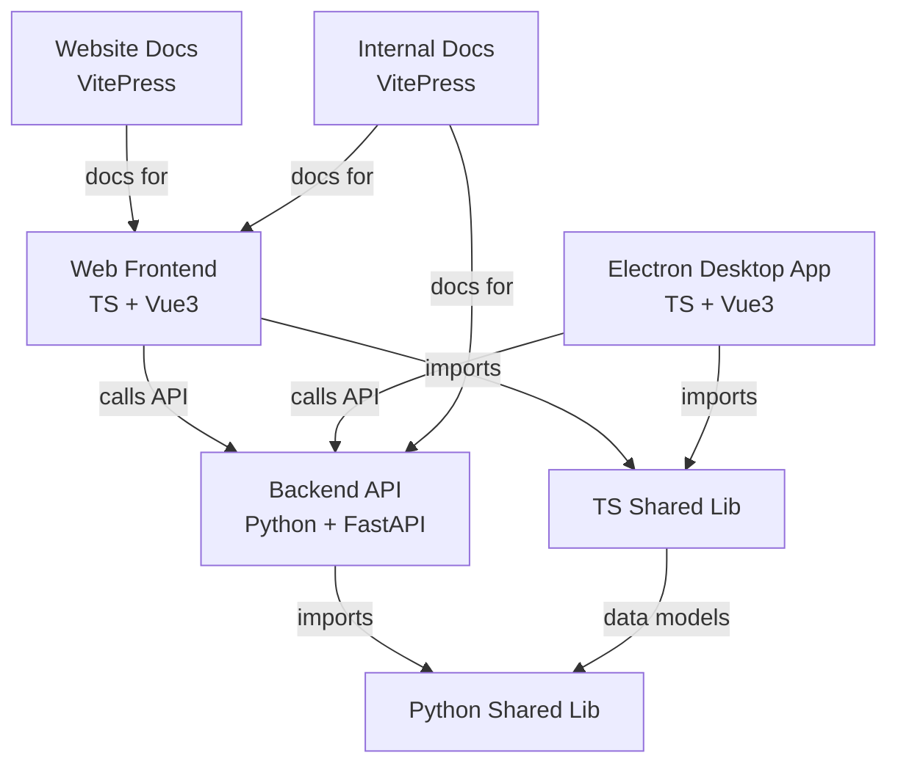

```kotlin
apps/
  webs/
  electron/

package/
  components/
  utils/
  axios/

docs/
  website/
  internal/
```

1. 使用 pnpm depcheck 检查当前以安装但未使用的依赖项
2. 使用 pnpm commit 简化 commit 提交消息
3. 使用 pnpm lint:prettier 格式化当前代码
4. 使用 pnpm eslint 进行代码静态检查
5. 使用 lint:spellcheck 进行拼写检查
6. 使用 lint:typecheck 进行ts编译检查

# Workspace

如果需要依赖内部 package 中的包，需要使用包名的方式

```json
{
  "dependencies": {
    "@monorepo-example/utils": "workspace:*"
  }
}
```

pnpm 支持 monorepo 安装子包, 只需要在 pnpm-workspace 中添加子包的路径, 即可自动安装子包依赖

tsconfig.json 的继承规则

- 子配置中存在的键 → 覆盖父配置的键
- 子配置中不存在的键 → 继承父配置的值
- 数组类型（如 include、exclude、files） → 不合并，完全覆盖
- references → 合并行为依赖 TypeScript 版本，一般是追加

```json
{
  "compilerOptions": {
    "target": "ES2020",
    "module": "ESNext",
    "strict": true,
    "noImplicitReturns": true
  },
  "exclude": ["node_modules"]
}
```

然后在子项目里写：

```json
{
  "extends": "../../tsconfig.base.json",
  "compilerOptions": {
    "module": "CommonJS"
  }
}
```

结果：

- module 被子配置覆盖 → "CommonJS"
- target 继承自根配置 → "ES2020"
- strict、noImplicitReturns 也继承自根配置 → true
- exclude 也继承 → ["node_modules"]

运行指定项目
pnpm --filter apps/web dev

## Changeset

当你修改了某个包或功能后，创建一个 changeset
`pnpm changeset`

每次运行 pnpm changeset 创建的变更文件 (.md) 会包含：

影响的 package

变更类型：

major → 大版本，可能包含破坏性变更

minor → 小版本，添加功能，但向下兼容

patch → 补丁，修复 bug，向下兼容

例如 .changeset/my-change.md 内容：

```yaml
---
"my-package": patch
---
Fixed a bug in my-package
```

patch → 发布 patch
minor → 发布 minor
major → 发布 major

发布时如何决定版本号

当你运行：

`pnpm changeset version`

Changesets 会读取所有未发布的 .changeset 文件

根据其中标记的 major / minor / patch 决定下一个版本

支持多个 package 的 monorepo，自动计算每个 package 的下一个版本
