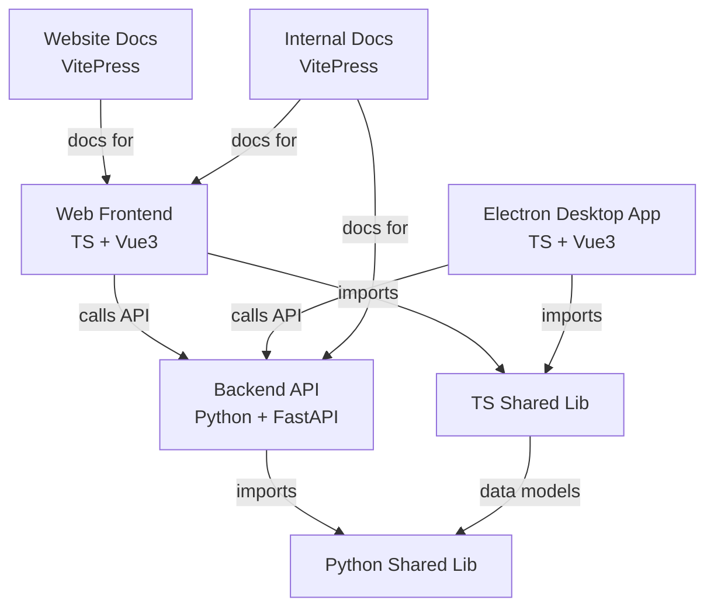

```kotlin
apps/
  webs/
  electron/

package/
  components/
  utils/
  axios/

docs/
  website/
  internal/
```

1. 使用 pnpm depcheck 检查当前以安装但未使用的依赖项
2. 使用 pnpm commit 简化 commit 提交消息
3. 使用 pnpm lint:prettier 格式化当前代码
4. 使用 pnpm eslint 进行代码静态检查
5. 使用 lint:spellcheck 进行拼写检查
6. 使用 lint:typecheck 进行ts编译检查
