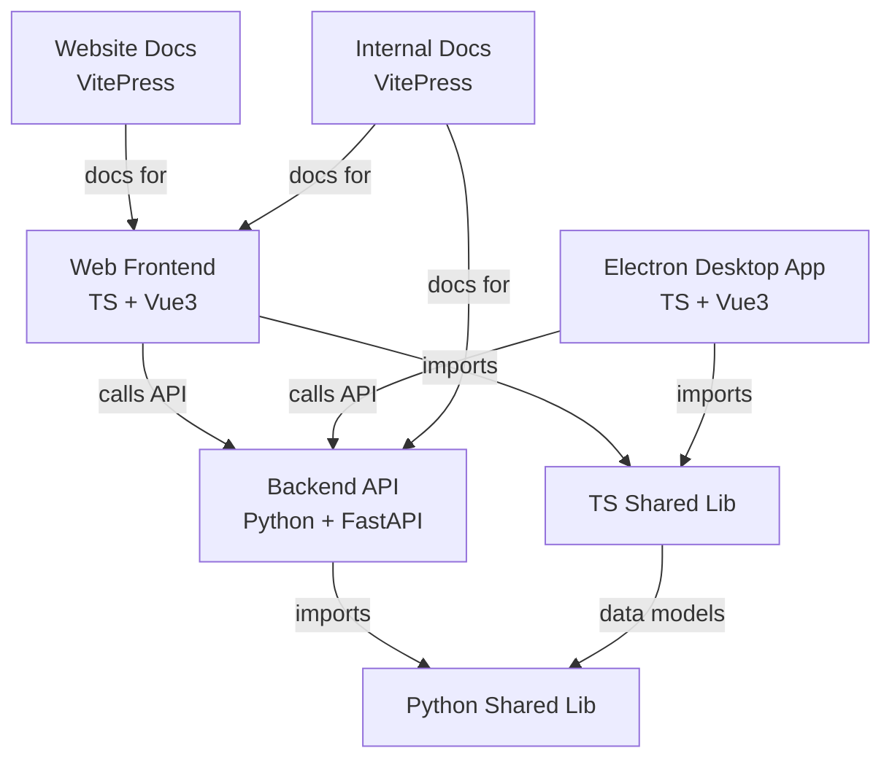

```mermaid
flowchart TD
    %% Apps
    Web[Web Frontend<br>TS + Vue3]
    Electron[Electron Desktop App<br>TS + Vue3]
    Backend[Backend API<br>Python + FastAPI]
    WebsiteDocs[Website Docs<br>VitePress]
    InternalDocs[Internal Docs<br>VitePress]

    %% Shared libraries
    TSShared[TS Shared Lib]
    PyShared[Python Shared Lib]

    %% Dependencies
    Web -->|calls API| Backend
    Electron -->|calls API| Backend
    Web -->|imports| TSShared
    Electron -->|imports| TSShared
    Backend -->|imports| PyShared
    WebsiteDocs -->|docs for| Web
    InternalDocs -->|docs for| Web
    InternalDocs -->|docs for| Backend

    %% Optional connections
    TSShared -->|data models| PyShared
```
